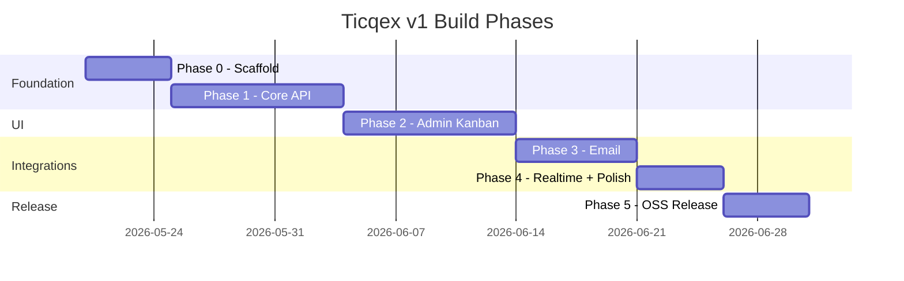

# Phased Build Plan

> Related: [VISION.md](./VISION.md) · [DATA-MODEL.md](./DATA-MODEL.md) · [API.md](./API.md) · [INTEGRATIONS.md](./INTEGRATIONS.md)

## Phase map



Timelines are estimates for a solo/small team. Phases are sequential — each depends on the previous.

---

## Phase 0 — Foundation

**Goal:** Runnable project skeleton with database, auth, and service layer pattern.

### Deliverables

- [x] Next.js app scaffold (App Router, TypeScript, Tailwind)
- [x] Supabase project linked (local dev + cloud)
- [x] Initial migration: all tables from [DATA-MODEL.md](./DATA-MODEL.md)
- [x] Seed script: default statuses, admin user, sample data
- [x] RLS enabled on all tables; service role for API
- [x] Auth: Supabase email/password login for staff
- [x] Service layer structure (`/server/services/`, `/server/adapters/`)
- [x] `/enterprise` directory with README explaining open-core boundary
- [x] MIT LICENSE in root
- [x] Health check: `GET /api/health`

### Exit criteria

- `pnpm dev` runs
- Admin can log in
- Database has seeded statuses
- Migrations apply cleanly on fresh Supabase project

---

## Phase 1 — Core API

**Goal:** Full CRUD API for all entities. No UI yet — test with curl/Bruno/Postman.

Depends on: **Phase 0**

### Deliverables

- [x] Ticket CRUD + messages + find-or-create customer
- [x] Customer CRUD
- [x] Status types CRUD + reorder
- [x] Tags CRUD + ticket tagging
- [x] Custom field definitions CRUD
- [x] Custom field values read/write on tickets and customers
- [x] Global settings GET/PATCH
- [x] API key create/list/revoke
- [x] Auth middleware: staff JWT + API key
- [x] Ticket filtering (simple exact match, including custom fields)
- [x] `GET /tickets/:id/context` (copy for AI)
- [x] `GET /board` convenience endpoint
- [x] Input validation (Zod schemas)
- [x] Consistent error responses

### Exit criteria

- Full ticket lifecycle via curl with API key
- Custom field filter works: `?custom_fields.plan=Unlimited`
- Customer auto-created on ticket POST
- Internal vs public messages stored correctly

### Test script

```bash
# Create ticket
curl -X POST /api/v1/tickets -H "Authorization: Bearer tq_live_..." -d '{...}'

# List with filter
curl /api/v1/tickets?status_id=...&custom_fields.plan=Unlimited

# Copy context
curl /api/v1/tickets/:id/context
```

---

## Phase 2 — Admin Kanban GUI

**Goal:** The primary admin interface. All actions via API (no direct Supabase writes).

Depends on: **Phase 1**

### Deliverables

- [x] Staff login page
- [x] Kanban board view (`GET /board`)
  - [x] Lanes = status types (respect `visible_status_ids`)
  - [x] Ticket cards: title, preview, customer initials, assignee initials, custom fields, tags
  - [x] Drag-and-drop between lanes → `PATCH /tickets/:id` (status change)
- [x] Ticket detail panel/modal
  - [x] Message thread (public + internal, visually distinct)
  - [x] Reply box (public reply + internal note toggle)
  - [x] Edit title, assignee, tags, custom fields
  - [x] "Copy context" button → clipboard
- [x] Create ticket form (manual)
- [x] Settings pages (admin only)
  - [x] Status types management (add/reorder/color)
  - [x] Tags management
  - [x] Custom field definitions
  - [x] Board visibility settings
  - [x] API key management
- [x] Responsive layout (desktop-first; mobile usable)

### Exit criteria

- Agent can manage full ticket lifecycle without curl
- Admin can configure custom fields and see them on board
- Internal notes visually distinct; not included in copy-context by default toggle

### Design reference

Wireframe: Kanban with New / In Process / Done lanes. Cards show title, preview, RB initials (customer + assignee), "Plan: Unlimited" custom field label.

---

## Phase 3 — Email Integration

**Goal:** Inbound email creates/attaches tickets; public replies send outbound email.

Depends on: **Phase 2** (need admin UI to verify), **Phase 1** (API)

See [INTEGRATIONS.md](./INTEGRATIONS.md) for full spec.

### Deliverables

- [x] Resend adapter (`/server/adapters/email/resend.ts`)
- [x] Resend inbound webhook endpoint
- [x] Trigger.dev: inbound email processing job
  - [x] Parse email → find/create customer → match/create ticket → create message
  - [x] Threading: Message-ID / In-Reply-To first, subject + customer fallback
  - [x] Parse email attachments → Supabase Storage
- [x] Trigger.dev: outbound email job
  - [x] On public message via admin/API → send via Resend
  - [x] Proper threading headers (`In-Reply-To`, `References`)
- [x] Email metadata stored on messages (`email_message_id`, etc.)
- [x] `email_threads` table populated for fallback matching

### Exit criteria

- Send email to support address → ticket appears in "New" lane
- Reply to that email → message appended to existing ticket
- Reply from admin UI → customer receives email in thread
- Email attachment visible on message

---

## Phase 4 — Realtime + Polish

**Goal:** Live board updates and UX polish for daily use.

Depends on: **Phase 3**

### Deliverables

- [ ] Supabase Realtime subscription in admin UI
  - [ ] Ticket created/updated/moved → board updates live
  - [ ] New message → ticket card preview updates
- [ ] Optimistic UI for drag-and-drop (revert on API failure)
- [ ] Loading states, empty states, error toasts
- [ ] Keyboard shortcuts (optional: `n` new ticket, `/` search)
- [ ] Ticket search (title + customer username, simple text match)
- [ ] Trigger.dev: scheduled jobs setup
  - [ ] Stale ticket digest (optional, configurable)
  - [ ] Cleanup orphaned attachments

### Exit criteria

- Two browser tabs: move ticket in one, other updates within ~1s
- No broken states on network failure
- Email → board appears without manual refresh

---

## Phase 5 — Open Source Release

**Goal:** Publish as MIT open-core project. Others can self-host.

Depends on: **Phase 4**

### Deliverables

- [ ] README with project overview, screenshot, quick start
- [ ] `CONTRIBUTING.md`
- [ ] `.env.example` with all required vars documented
- [ ] Setup guide: Vercel + Supabase Cloud step-by-step
- [ ] OpenAPI spec (`docs/openapi.yaml`)
- [ ] GitHub repo public with MIT license
- [ ] `/enterprise/README.md` explaining open-core model
- [ ] Basic CI: lint + typecheck on PR
- [ ] Seed/demo mode for evaluators

### Exit criteria

- Fresh clone → running instance in < 30 min following docs
- All v1 success criteria from [VISION.md](./VISION.md) met

---

## Future phases (post-v1)

Not scheduled. Documented so v1 architecture doesn't block them.

### Phase 6 — Docker self-host

- Docker Compose: Next.js + Supabase (local stack) or standalone Postgres
- One-command deploy for on-prem users

### Phase 7 — Webhooks

- `webhook_endpoints` + `webhook_deliveries` tables
- Events: `ticket.created`, `ticket.updated`, `message.received`, etc.
- Trigger.dev delivery with retries + signing

### Phase 8 — Multi-tenant / Ticqex Cloud

- `workspace_id` on all entities
- Workspace management UI
- Hosted offering with billing
- Enterprise features in `/enterprise`

### Phase 9 — Customer portal

- Public-facing ticket status page
- Customer auth (magic link?)
- Uses same API

### Phase 10 — Enterprise features

- Audit log
- SLAs, priorities, due dates
- SSO / SAML
- Advanced analytics
- Manual file uploads

---

## Dependency graph

```
Phase 0 (Foundation)
  └── Phase 1 (Core API)
        └── Phase 2 (Admin GUI)
              └── Phase 3 (Email)
                    └── Phase 4 (Realtime + Polish)
                          └── Phase 5 (OSS Release)
                                ├── Phase 6 (Docker)
                                ├── Phase 7 (Webhooks)
                                ├── Phase 8 (Multi-tenant)
                                ├── Phase 9 (Customer portal)
                                └── Phase 10 (Enterprise)
```

## Risk register

| Risk | Mitigation |
|------|------------|
| Email threading edge cases | Message-ID first; log unmatched emails for manual review |
| Custom field query performance | Index `custom_field_values(field_id, value_text)`; optimize in Phase 4 if needed |
| Realtime + API-only writes | Realtime is read-only push; mutations always via API |
| Scope creep into enterprise features | `/enterprise` boundary + PHASES doc keeps v1 focused |
| Supabase vendor lock-in | Accepted decision; revisit if self-host demand is high (Phase 6) |
